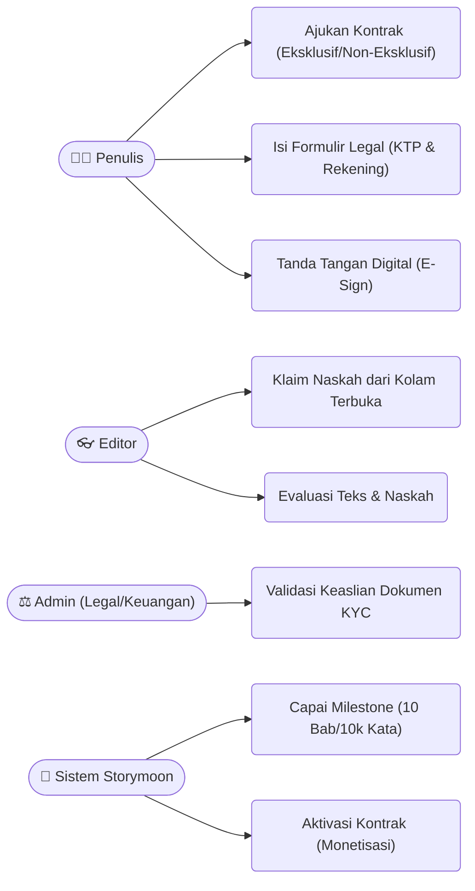
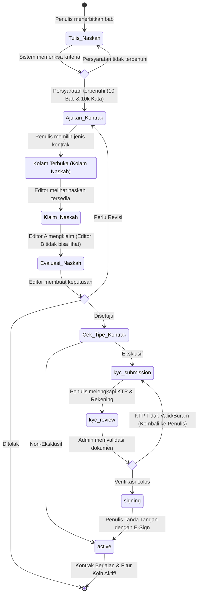
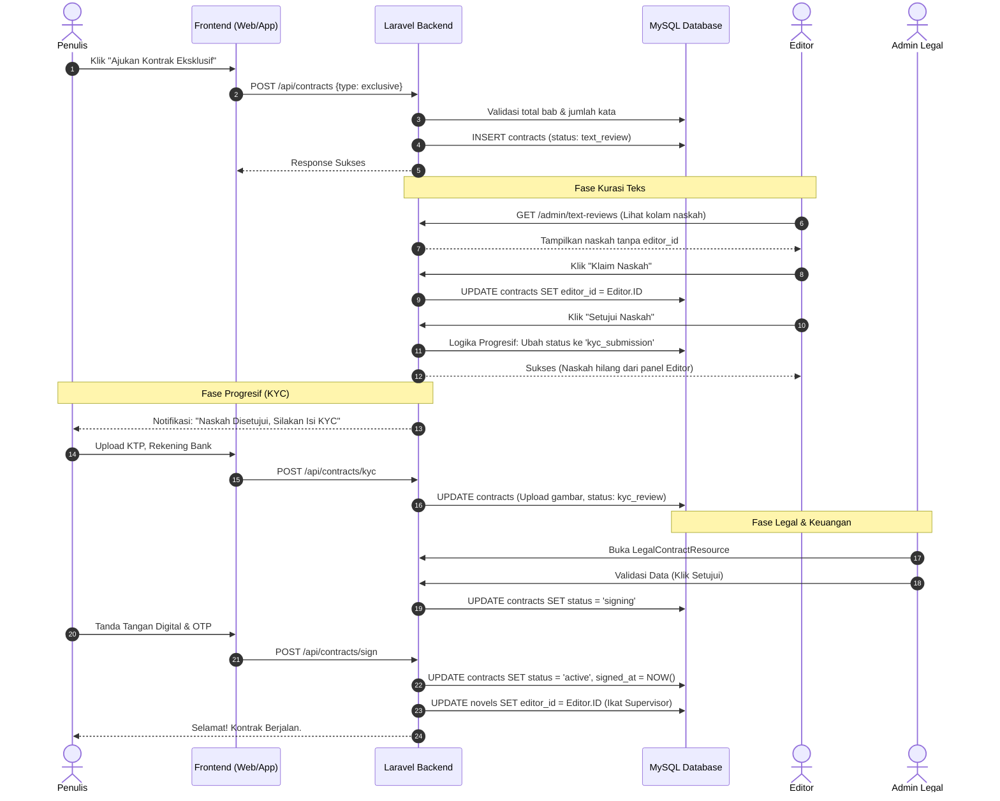

# Arsitektur Alur Kerja Kontrak

## Ringkasan

Dokumen ini menguraikan arsitektur logika bisnis untuk sistem pengajuan dan validasi kontrak. Memetakan alur kerja dari:

- **Penulis** memenuhi persyaratan minimum naskah
- **Editor** proses kurasi (sistem klaim naskah)
- **Admin Keuangan** verifikasi legal (KYC - Know Your Customer)

## Daftar Isi

1. [Diagram Use Case](#diagram-use-case-aktor--hak-akses)
2. [Diagram Aktivitas](#diagram-aktivitas-alur-kerja-progresif)
3. [Diagram Urutan](#diagram-urutan-interaksi-sistem--database)

---

## Diagram Use Case (Aktor & Hak Akses)

Diagram ini menunjukkan semua tindakan yang mungkin dilakukan oleh setiap aktor dalam subsistem Kontrak:

---

## Diagram Aktivitas (Alur Kerja Progresif)

Diagram aktivitas ini mewakili inti dari sistem Progressive Onboarding kami. Perhatikan bagaimana jalur Non-Eksklusif mengambil "jalan pintas", sementara jalur Eksklusif harus melewati verifikasi KYC Admin:

---

## Diagram Urutan (Interaksi Sistem & Database)

Diagram urutan ini menunjukkan bagaimana Frontend, Backend (Laravel), dan Database berinteraksi ketika penulis mengajukan kontrak Eksklusif hingga persetujuan:

---

## Fitur Utama

### Progressive Onboarding

Alur kerja secara progresif meminta informasi dari penulis berdasarkan jenis kontrak:

- **Non-Eksklusif**: Jalur cepat tanpa persyaratan KYC
- **Eksklusif**: Verifikasi KYC lengkap oleh Admin Keuangan

### Sistem Klaim Naskah

- Editor melihat naskah yang tersedia di kolam terbuka
- Hanya satu editor yang dapat mengklaim naskah dalam satu waktu
- Naskah yang diklaim hilang dari kolam untuk editor lain

### Deteksi Milestone Otomatis

- Sistem secara otomatis mendeteksi ketika penulis memenuhi persyaratan (10 bab, 10k kata)
- Mengaktifkan pengajuan kontrak setelah kriteria terpenuhi

### Aktivasi Kontrak

- Setelah persetujuan akhir, kontrak menjadi aktif
- Editor terikat dengan novel tersebut
- Fitur koin dan monetisasi menjadi tersedia
