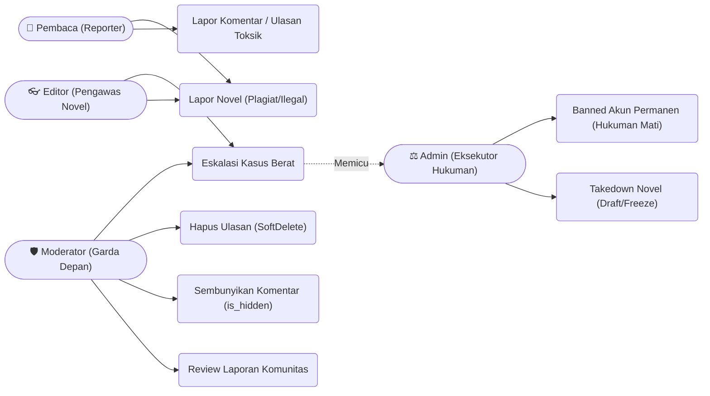
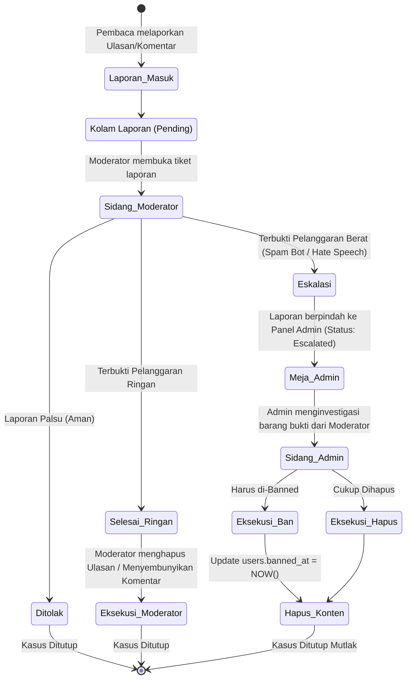
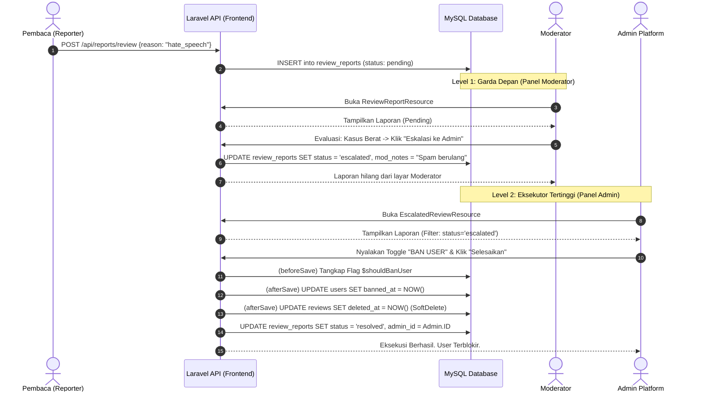

# Arsitektur Alur Kerja Moderasi

## Ringkasan

Dokumen ini memetakan alur kerja sistem keamanan komunitas Storymoon yang mencakup moderasi Komentar, Ulasan, dan Novel. Sistem ini menggunakan arsitektur **Eskalasi Bertingkat** (Tiered Escalation) di mana:

- **Moderator** bertindak sebagai garda terdepan (menyembunyikan/menghapus konten)
- **Admin** bertindak sebagai eksekutor hukuman berat (pemblokiran akun)

## Daftar Isi

1. [Diagram Use Case](#diagram-use-case-aktor--hak-akses-moderasi)
2. [Diagram Aktivitas](#diagram-aktivitas-alur-penanganan-laporan-toksik)
3. [Diagram Urutan](#diagram-urutan-sistem-eskalasi--tombol-nuklir-admin)
4. [Fitur Utama](#fitur-utama)

---

## Diagram Use Case (Aktor & Hak Akses Moderasi)

Diagram ini menunjukkan pembagian wewenang yang sangat ketat (RBAC - Role-Based Access Control) antara berbagai aktor dalam sistem moderasi:

---

## Diagram Aktivitas (Alur Penanganan Laporan Toksik)

Diagram ini menjelaskan alur keputusan ketika ada laporan yang masuk. Perhatikan bagaimana tindakan ringan diselesaikan di level Moderator, sementara tindakan berat (membutuhkan pemblokiran) dilempar ke Admin:

---

## Diagram Urutan (Sistem Eskalasi & Tombol Nuklir Admin)

Diagram urutan ini menunjukkan bagaimana sistem mengelola alur data laporan antara Database, Panel Moderator, dan Panel Admin:

---

## Fitur Utama

### Eskalasi Bertingkat

Sistem moderasi menggunakan tingkat eskalasi yang jelas:

- **Level 1 - Moderator**: Menyembunyikan komentar atau menghapus ulasan
- **Level 2 - Admin**: Pemblokiran akun permanen dan penghapusan konten massal

### Pelaporan Komunitas

- Pembaca dapat melaporkan komentar, ulasan, atau novel yang melanggar kebijakan
- Setiap laporan masuk ke kolam laporan (pending) untuk ditinjau
- Moderator melakukan investigasi dan memberikan rekomendasi

### RBAC (Role-Based Access Control)

Sistem membatasi akses berdasarkan peran:

- **Moderator**: Review dan kelola konten ringan (sembunyikan/hapus)
- **Admin**: Hanya menangani kasus eskalasi dan pemblokiran akun
- **Editor**: Dapat melaporkan novel yang bermasalah

### Soft Delete & Audit Trail

- Ulasan dan konten dihapus secara soft (tidak dari database)
- Admin dapat melacak riwayat tindakan moderasi
- Setiap keputusan dicatat dengan alasan dan timestamp
