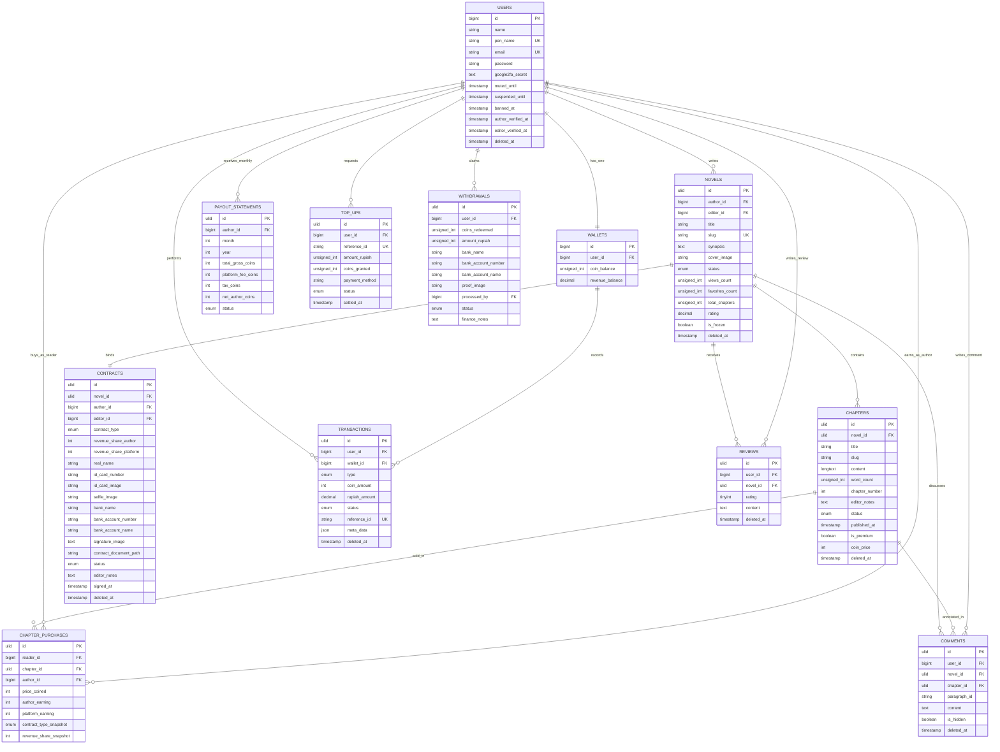

# Database Architecture Documentation

## Overview

This documentation covers the Entity Relationship Diagram (ERD) and Logical Record Structure (LRS) for the Storymoon platform. The architecture is optimized for high scalability using a combination of:

- **Increment ID**: For master tables
- **ULID**: For large-scale transactional tables

## Table of Contents

1. [Entity Relationship Diagram](#entity-relationship-diagram-erd)
2. [Logical Record Structure](#logical-record-structure-lrs)

---

## Entity Relationship Diagram (ERD)

The following diagram visualizes the relationships between entities in the Storymoon platform:



---

## Logical Record Structure (LRS)

The LRS maps the data structure above into Foreign Key (FK) constraints that enforce business logic integrity rules:

### Core Entity Structures

#### Users

```
users (id [PK], name, pen_name, email, ...)
```

#### Wallets

```
wallets (id [PK], user_id [FK -> users.id - UNIQUE], coin_balance, revenue_balance)
```

#### Novels

```
novels (id [PK], author_id [FK -> users.id], editor_id [FK -> users.id - NULLABLE], title, slug [UNIQUE], ...)
```

#### Chapters

```
chapters (id [PK], novel_id [FK -> novels.id], title, slug, chapter_number, ... [UNIQUE composite: novel_id + slug])
```

#### Contracts

```
contracts (id [PK], novel_id [FK -> novels.id], author_id [FK -> users.id], editor_id [FK -> users.id - NULLABLE], ... [UNIQUE composite: novel_id + status as active contract guard])
```

#### Transactions

```
transactions (id [PK], user_id [FK -> users.id], wallet_id [FK -> wallets.id], reference_id [UNIQUE], coin_amount, rupiah_amount, ...)
```

#### Chapter Purchases

```
chapter_purchases (id [PK], reader_id [FK -> users.id], chapter_id [FK -> chapters.id], author_id [FK -> users.id], ...)
```

#### Payout Statements

```
payout_statements (id [PK], author_id [FK -> users.id], ... [UNIQUE composite: author_id + month + year to prevent duplicate statements])
```

#### Top-ups

```
top_ups (id [PK], user_id [FK -> users.id], reference_id [UNIQUE], ...)
```

#### Withdrawals

```
withdrawals (id [PK], user_id [FK -> users.id], processed_by [FK -> users.id - NULLABLE], ...)
```

#### Reviews

```
reviews (id [PK], user_id [FK -> users.id], novel_id [FK -> novels.id], ... [UNIQUE composite: user_id + novel_id to prevent review bombing])
```

#### Comments

```
comments (id [PK], user_id [FK -> users.id], novel_id [FK -> novels.id], chapter_id [FK -> chapters.id - NULLABLE], ...)
```

```

```
